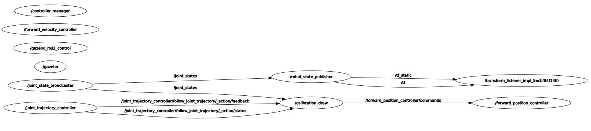

# UR5_Cafetero_ROS2

## Project overview

This ros2 pkg vectorizes an image and creates paths for a robotic arm, such as a UR5, to draw in a 2D plane.

## System diagram



## Prerquisites and dependencies

This project requires the following softwares:
- Ubuntu 22.04
- ROS 2 [Humble](https://docs.ros.org/en/humble/Installation/Ubuntu-Install-Debs.html)
- Gazebo Classic
- Docker [Desktop](https://docs.docker.com/desktop/setup/install/linux/ubuntu/)

If you don't want to use docker:
- UR5 official [repo](https://github.com/UniversalRobots/Universal_Robots_ROS2_GZ_Simulation)
- Gazebo [Fortress](https://gazebosim.org/docs/latest/ros_installation/)

## Installation instructions

After installing the required packages from the UR5 official repo, we just need to clone this repo into the same workspace
```bash
cd ros2_ws/src
git clone https://github.com/Daniel-Flores-19/UR5_Cafetero_ROS2.git
cd ..
colcon build
source install/setup.bash
```
This will allow the user to use this entire project with/without docker

## Usage 
### With Docker
To use it with docker we need to build the image inside the repo.
```bash
cd ros2_ws/src/UR5_Cafetero_ROS2
docker build -t ur5_draw .
```
Then, we should be able to see the ID and the name of the image
```bash
docker ps
```
To run a terminal inside the container, it is recommended to add local connections to enable RVIZ2 and Gazebo
```bash
xhost +local:docker
docker run -it --network=host --ipc=host -v /tmp/.X11-unix:/tmp/.X11-unix:rw --env=DISPLAY ur5_draw:latest
```

Once inside the container, we should be able to see all the files and build the workspace with all the packages.
```bash
cd ros2_ws
colcon build
source install/setup.bash
```


## Project structure

```text
├── Dockerfile
├── LICENSE
├── README.md
├── bashrc
├── cafetero
│   ├── cafetero
│   │   ├── __init__.py
│   │   ├── fk_functions.py
│   │   ├── ik_functions.py
│   │   ├── kine_control_functions.py
│   │   ├── paneo_ur5.py
│   │   ├── paneo_ur5_uniforme.py
│   │   └── show_qr.py
│   ├── package.xml
│   ├── resource
│   │   └── cafetero
│   ├── setup.cfg
│   ├── setup.py
│   └── test
│       ├── test_copyright.py
│       ├── test_flake8.py
│       └── test_pep257.py
├── entrypoint.sh
├── ur5_algoritmos
│   ├── launch
│   │   ├── dibujo_completo.launch.py
│   │   ├── ur5_draw_v1.launch.py
│   │   └── ur5_view.launch.py
│   ├── package.xml
│   ├── resource
│   │   └── ur5_algoritmos
│   ├── setup.cfg
│   ├── setup.py
│   ├── test
│   │   ├── test_copyright.py
│   │   ├── test_flake8.py
│   │   └── test_pep257.py
│   └── ur5_algoritmos
│       ├── Playwrite_CU
│       │   ├── OFL.txt
│       │   ├── PlaywriteCU-VariableFont_wght.ttf
│       │   ├── README.txt
│       │   └── static
│       │       ├── PlaywriteCU-ExtraLight.ttf
│       │       ├── PlaywriteCU-Light.ttf
│       │       ├── PlaywriteCU-Regular.ttf
│       │       └── PlaywriteCU-Thin.ttf
│       ├── QP_functions.py
│       ├── QP_ur5.py
│       ├── __init__.py
│       ├── array_new_v7.py
│       ├── array_new_v8.py
│       ├── calibration_draw.py
│       ├── fk_functions.py
│       ├── fk_ur5.py
│       ├── fk_ur5_gazebo.py
│       ├── ik_functions.py
│       ├── ik_ur5.py
│       ├── imagen_trajectory.py
│       ├── imagen_trajectory_new.py
│       ├── kine_control_functions.py
│       ├── kine_control_ur5.py
│       ├── letter_trajectory_arrays.py
│       ├── letter_trajectory_arrays_nuevo.py
│       ├── letter_trajectory_functions.py
│       ├── letter_trajectory_functions_img.py
│       ├── letter_trajectory_functions_v6.py
│       ├── letter_trajectory_functions_v7.py
│       ├── markers.py
│       ├── move_draw.py
│       ├── move_draw_escale.py
│       ├── move_draw_new.py
│       ├── move_draw_sub.py
│       ├── p_llm_interface.py
│       ├── p_test_llm_track.py
│       └── p_test_llm_track_gazebo.py
└── ur_simulation_gazebo
    ├── CMakeLists.txt
    ├── config
    │   └── ur_controllers.yaml
    ├── launch
    │   ├── ur_sim_control.launch.py
    │   ├── ur_sim_lab201.launch.py
    │   ├── ur_sim_lab201.py
    │   └── ur_sim_moveit.launch.py
    ├── models
    │   ├── bidon
    │   │   ├── meshes
    │   │   │   ├── QR (1).png
    │   │   │   ├── QR.png
    │   │   │   ├── Untitled.mtl
    │   │   │   └── Untitled.obj
    │   │   ├── model.config
    │   │   └── model.sdf
    │   ├── surgery_table
    │   │   ├── meshes
    │   │   │   ├── surgery_table.dae
    │   │   │   └── surgery_table.stl
    │   │   ├── model.config
    │   │   └── model.sdf
    │   └── ur5_base
    │       ├── meshes
    │       │   ├── ur5_base.dae
    │       │   └── ur5_base.stl
    │       ├── model.config
    │       └── model.sdf
    ├── package.xml
    ├── test
    │   ├── test_common.py
    │   └── test_gazebo.py
    └── world
        └── lab_base_world_classic.sdf

```

## Features and roadmap

## References
